<!-- title: Bulk RNA sequencing -->
**Notes on HPC and bioinformatics**

These are a series of notes that I made after completing my thesis project. I wish to record the packages and some of the scripts that I frequently used throughout the project. Please note that the information may not be 100% correct so please use the code with caution.


# Section 2: Bulk RNA Sequencing for Differential Gene Expression (DGE) Analysis (Part 1)

In this section, we discuss the overall procedure for bulk RNA-seq analysis for DGE analysis, specifically in pair-end context (single-end scripts are very similar!). Due to my (unexpected) wordiness this section will only cover **Quality control and read trimming** and **Alignment**.

**Table of contents**
- [Section 2: Bulk RNA Sequencing for Differential Gene Expresison Analysis (Part 1)](#section-2-bulk-rna-sequencing-for-differential-gene-expresison-analysis-part-1)
  - [1. Overview of bulk RNA-seq analysis](#1-overview-of-bulk-rna-seq-analysis)
  - [2. Quality control and read trimming](#2-quality-control-and-read-trimming)
    - [2.1 Studying fastq quality using `fastqc`](#21-studying-fastq-quality-using-fastqc)
    - [2.2 Trimming reads using `cutadapt`](#22-trimming-reads-using-cutadapt)
  - [3. Aligning trimmed reads to reference genome with `STAR`](#3-aligning-trimmed-reads-to-reference-genome-with-star)
    - [3.1 Aligning reads using `STAR`](#31-aligning-reads-using-star)
      - [3.1.1 Downloading assembly and annotation files](#311-downloading-assembly-and-annotation-files)
      - [3.1.2 Generating STAR index](#312-generating-star-index)
      - [3.1.3 Aligning trimmed reads](#313-aligning-trimmed-reads)
      - [3.1.4 Other useful parameters](#314-other-useful-parameters)
  - [4. Quality-checking after alignment](#4-quality-checking-after-alignment)
    - [4.1 QC on `STAR` log files | total reads, unique alignment rate](#41-qc-on-star-log-files--total-reads-unique-alignment-rate)
      - [4.1.1 Total reads](#411-total-reads)
      - [4.1.2 Aligned and Uniq aligned rates](#412-aligned-and-uniq-aligned-rates)
    - [4.2 QC using `qualimap` / `RSeQC` | strandness, read distribution, gene coverage, GC bias](#42-qc-using-qualimap--rseqc--strandness-read-distribution-gene-coverage-gc-bias)
      - [4.2.1 Running `qualimap` and `RSeQC`](#421-running-qualimap-and-rseqc)
      - [4.2.2 Strandness \[`RSeQC`:`infer_experiment.py`\]](#422-strandness-rseqcinfer_experimentpy)
      - [4.2.3 Read distribution \[`qualimap`:*Genomic origin of reads*, `RSeQC`:`read_distribution.py`\]](#423-read-distribution-qualimapgenomic-origin-of-reads-rseqcread_distributionpy)
      - [4.2.4 Gene coverage \[`qualimap`:*Gene coverage profile*, `RSeQC`:`geneBody_coverage.py`\]](#424-gene-coverage-qualimapgene-coverage-profile-rseqcgenebody_coveragepy)
      - [4.2.5 GC bias \[`RSeQC`:`read_GC.py`\]](#425-gc-bias-rseqcread_gcpy)
    - [4.3 Other QC tools: `Picard`, `Preseq`, `dupRadar`](#43-other-qc-tools-picard-preseq-dupradar)


## 1. Overview of bulk RNA-seq analysis

The current note is specific for analysis of gene expression. Here is an overview of the analysis, which involves several individual processing steps (relevant file formats are specified in brackets):
1. **Quality control and read trimming** (input: fastq; output: fastq) For raw sequencing data, read trimming is performed to remove adapters and low quality regions (measured in *Phred quality scores*) at starts and ends of reads. Quality control is performed before and after trimming to study if the reads have significant quality problems.
2. **Alignment** (input: fastq; output: sam / bam) Trimmed reads are then aligned to a reference genome using a *splice-aware aligner* (which recognises introns and exons). Optional but not required, low quality alignments (reads that ambiguously map to several places) can be removed at this step. After alignment, you would like to perform extensive quality control on the aligned reads.
3. **Feature counting** (input: bam; output: transcript count table) At this step, the number of reads aligned to each *"feature"* (in our case, genes) will be counted using specific softwares to generate a count table.
4. **Differential gene expression analysis** (input: count table; metadata specifying experimental design) Differential gene expression analysis are directly performed on *raw* count table. Gene expression can be subsequently visualised using figures like *volcano plots* or *clustered heatmaps*.
5. **Functional analysis** After DEA, several downstream analyses can be performed to investigate features of the *differentially expressed genes*. For instance, *gene ontology analysis* and *gene set enrichment analysis* help to understand the functional roles of the differentially expressed genes. Additionally, interactions of these genes of interest (so called *network analysis*) can be studied using tools like *WGCNA* or *STRINGdb*.
 
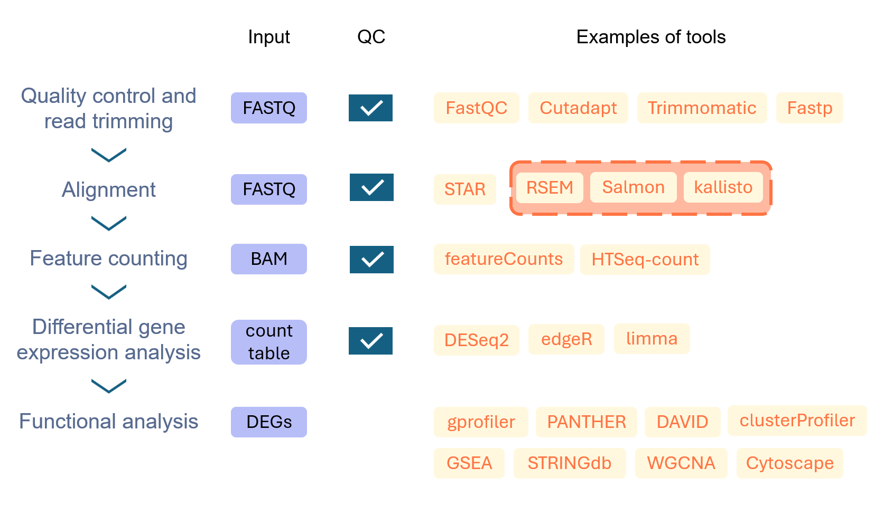
*Figure 1: Overview of bulk RNAseq processing.* QC, quality checking.

> **A brief note on transcript quanification tools**
>
> Tools like `Salmon`, `kallisto`, and `RSEM` are known as transcript quantification tools. They differ from gene quantification tools, such as `subread featureCounts`, `HTSeq-count`, or `STAR --quantMode GeneCounts`.
> 
> Instead of counting with respect to genomic coordinates, transcript quantification tools can generate expected counts (often not a whole number) for transcripts using algorithms like expectation maximisation, making them more accurate in studying **isoforms** or assigning **multi-mapping reads**. From there, transcript counts can be aggregated to gene-level using R package `tximport`, making results compatible with DGE analysis. 
>
> `kallisto` and `Salmon` are pseudoaligners, meaning that they can take in `fastq` and efficiently perform both alignment with respect to transcripts and feature counting. `RSEM` and `Salmon` can accept input `bam` files created from aligners like `STAR` against transcriptome and perform quantification from there. Finally, gene-level quantification tools always require `bam` against genome coordinates as input.

## 2. Quality control and read trimming

For all next-generation sequencing data (including RNA-seq), it is important to perform quality control and read trimming before the alignment to ensure that the sequencing experiments work and high-quality reads are used alignment. Additionally, read trimming is important to avoid *adapter contamination* (adapters often occurs at tail - i.e., 3' end of the read).

### 2.1 Studying fastq quality using `fastqc`

`fastqc` is a command line tool that can be used to generate quality reports for `fastq` files ([Documentation](https://www.bioinformatics.babraham.ac.uk/projects/fastqc/Help/)). It is very simple to use, just specify the file name:

```bash
fastqc filename.fastq
```

This command will generate an `html` report. To aggregate all reports and summarise them into a single file, try `multiqc`, which is another command line tool ([Webpage](https://docs.seqera.io/multiqc/reports)). `multiqc`'s parser will automatically study the report type and assemble all reports.

```bash
# Do this after generating all fastq reports
# Navigate to the directory
multiqc *.html
```
In the aggregated report, there are several statistics. Here are a few examples:
1. **Sequence Quality Histogram**: Mean Phred score for each position in the read. Usually, tails will have lower Phred scores, which can be improved via *end trimming*. Ideally, reads shall have *Phred Score above 20 - 25* for entire length.
   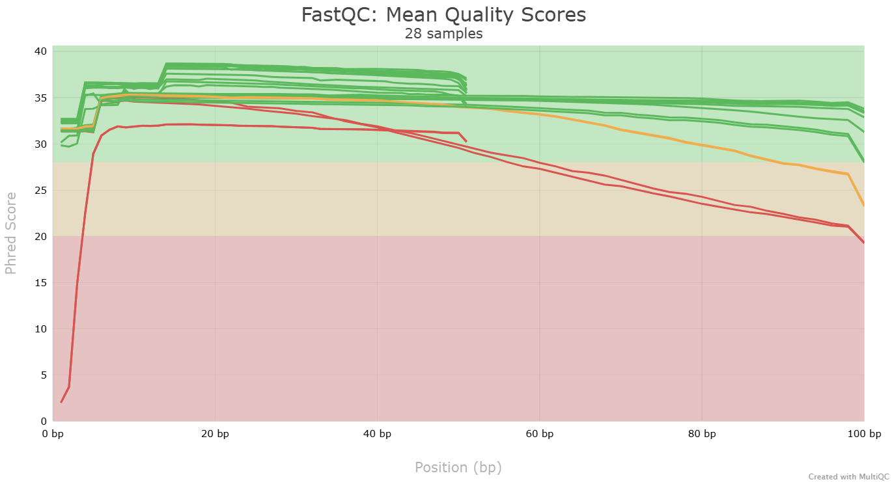 
*Samples with a dip in quality at 3' end can be rescued using quality trimming.*

2. **Per Base Sequence Content**: The proportion of each base position for which each of the four normal DNA bases has been called. Ideally, the proportion should be consistent across the read (i.e., 4 horizontal lines). It is common that the first few bases at heads have varying proportions (see below for an example). This is caused by the use of *randomised hexamers* as primers in next-generation sequencing. While the appearance of these fluctuations may cause fastq to generate a lower score in quality checks, they do not mean the library has low quality and shall be safely ignored.
   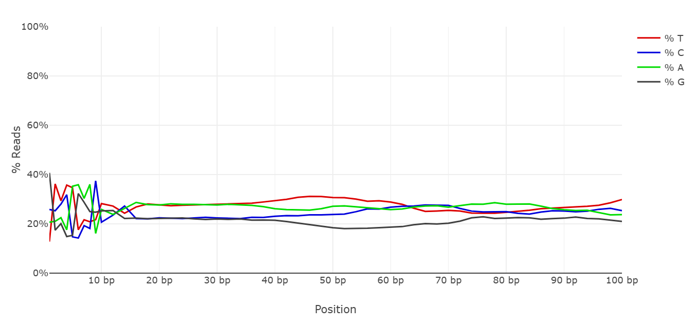
*The first 10 bases in this figure can be ignored*
3. **Per Sequence GC content**: The GC content shall be in a *bell curve*. Two peaks / Binomial distribution likely indicates contaminations, such as from bacterial genome.
   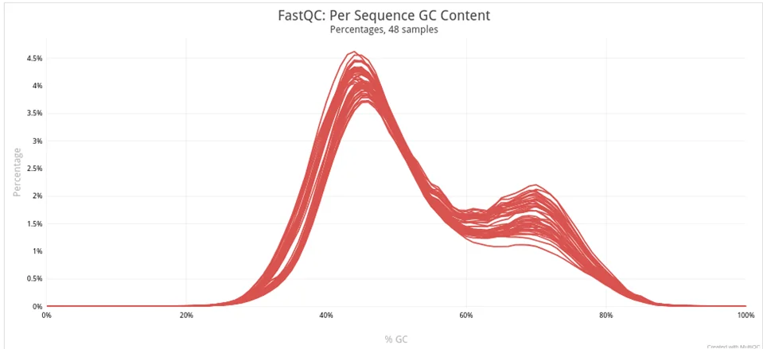
*This is a figure I took from this [discussion](https://www.reddit.com/r/bioinformatics/comments/1imuyho/fastqc_gc_content/), where the author likely had some unknown contamination.*
1. **Top overrepresented sequences** and **Adapter content**: There sections are useful in determining adapter sequences that shall be removed during read-trimming. Also, look for appearances of repetitive nucleotides (such as poly-Gs) at Top overrepresented sequences sections, as they represent cases where two-colour system sequencers fail to read the sequence and shall also be removed. They often cannot be detected by simple quality-trimming, since sequencers will assign a very high Phred score to these poly-Gs. After trimming the adapters, you may want to do `fastqc` check again and compare these sections to see if trimming is effective.
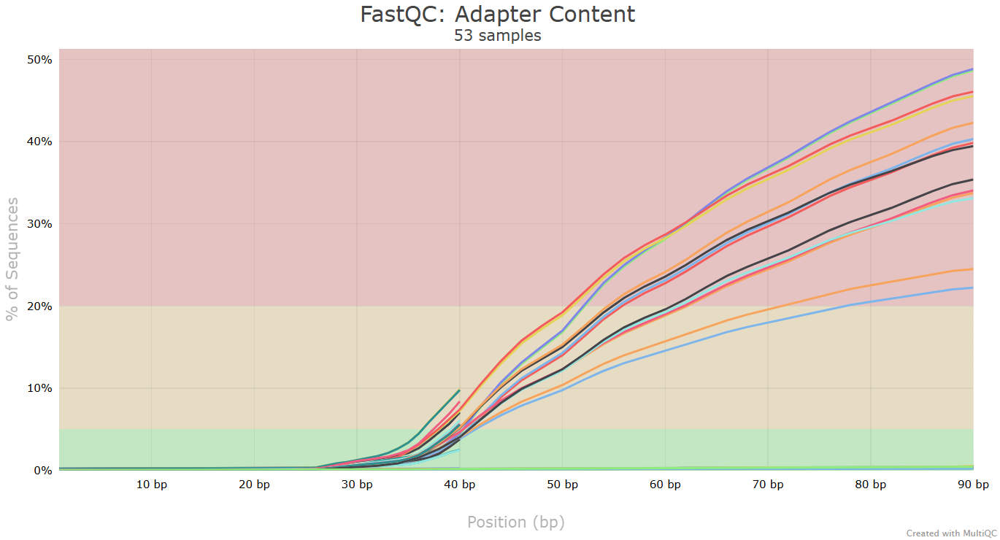

`fastqc` check shall be used to guide downstream processing. For example, consider the following questions:
- Does read have very low Phred scores? Are there fluctuations in sequence content throughout the read? Are there very high per base N content? -> Perhaps the library has very low quality and the sequencing need to be repeated.
- Is there a noticeable drop in read quality at tails? -> Do quality trimming with tools like `trimmomatic` or `cutadapt` to remove these regions. Consider aligners that can perform soft-clipping.
- Is there significant adapter contamination? -> Study which adapter is overrepresented and remove them from the tails.

### 2.2 Trimming reads using `cutadapt`

Here we discuss using `cutadapt` ([Documentation](https://cutadapt.readthedocs.io/en/stable/)) to remove adapters and do quality trimming. 

Apart from `cutadapt`, there are other useful tools. For example, `trimmomatic` ([Manual](http://www.usadellab.org/cms/uploads/supplementary/Trimmomatic/TrimmomaticManual_V0.32.pdf)) can do quality trimming using a *sliding window*. `fastp` ([Manual](https://open.bioqueue.org/home/knowledge/showKnowledge/sig/fastp)) is a newer tool that combines features from `fastqc`, `trimmomatic`, `cutadapt` and other tools. It guesses and trims adapters, performs quality trimming, and generates reports for reads before and after trimming. You can pick a tool that works best, but `cutadapt` is certainly a safe choice to begin with.

Before using `cutadapt`, it is important to know the adapter sequences that you would like to remove.

> **How does adapter contamination takes place in Illumina sequencing, and where to find the sequence to trim?**\
>Note: this section is specific for Illumina sequence-by-synthesis technology. You can read more from their [website](https://knowledge.illumina.com/software/general/software-general-reference_material-list/000002905). 
>
> *Adapter contamination*
> 
> Adapter contamination takes place during **readthrough**, i.e. whenever the read being sequenced is longer than the insert and extends into the **index adapter**, leading to unwanted sequences at the **3' end** of the reads. Specifically, the adapter sequences used for trimming (hereafter referred as "adapter sequences") is a component of the index adapters known as **sequencing primer binding sites** (SP). In Illumina sequencing, adapter contamination **does not occur at the 5' end**, since sequencing start at the beginning of DNA insert, unless the read is a primer-dimer.
>
> There are two SPs at each end of an insert. In Illumina's pair-end sequencing, while adapter sequence of R1 is always the **same** as SP2, the adapter sequence of R2 needs to be the **reverse complement** of SP1. However, there are cases (including MiSeq and HiSeq 2000/2500) where the forward version of SP1 shall be trimmed for R2 (Read more [here](https://support-docs.illumina.com/SHARE/AdapterSequences/Content/Overview.htm#Index)). Therefore, the correct orientation of R2 adapter should always be carefully checked.
>
>*Finding adapter sequences*
>
> You can usually find adapter sequences at websites of the  library prep kit. If you do not know the kit used for your data, it is often useful to study the `fastqc` reports, specifically "Adapter content" section, since `fastqc` will try to guess the kit being used based on overrepresented sequences.
>  
> 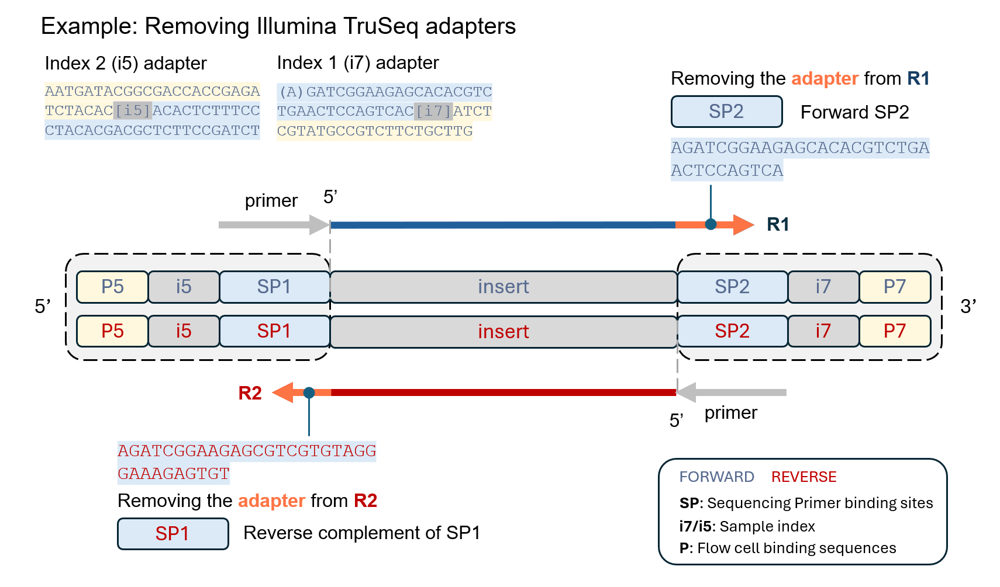
> *Figure: Removing adapters for TruSeq*. All sequences can be found [here](https://support-docs.illumina.com/SHARE/AdapterSequences/Content/UDIndexes.htm).

After finding the adapter sequences, it's time to use `cutadapt` to remove them. Flags `-a` and `-A` specifies the 3' adapter for `R1` and `R2`, respectively. 

Here is an example:

```bash
# This is a PE example
cutadapt -a "${R1_3_adapter}" -A "${R2_3_adapter}" \
--minimum-length=10 -q 20 \
--cores=16 \
-o ${OUTDIR}/${testID}_R1_trimmed.fq.gz \
-p ${OUTDIR}/${testID}_R2_trimmed.fq.gz \
${read1File} ${read2File}
```

In this example, quality trimming (removing reads with low Phred scores at ends) is simultaneously performed using `-q=20` flag. For reads with poly-Gs, using `--nextseq-trim=20` flag will similarly perform quality trimming at ends but ignores G calls (treating them as low quality).

Finally, you may want to set a minimum length on all the reads generated from `cutadapt`. In the above example, we use `--minimum-length=10` but this can be set to other values. Presenting all trimmed reads to aligner without filtering abnormally short reads (potentially, reads with no length) may lead to errors downstream.

## 3. Aligning trimmed reads to reference genome with `STAR`

Here, we discuss using `STAR` to perform read alignment. There are other pseudoalignment tools, such as `salmon` or `kallisto`, which are very efficient in finding isotypes and assigning reads to transcripts but we won't discuss them for now (since I haven't used them!).

### 3.1 Aligning reads using `STAR`

Read alignment using `STAR` ([Manual](https://physiology.med.cornell.edu/faculty/skrabanek/lab/angsd/lecture_notes/STARmanual.pdf)) involves two steps:
1.  ***Indexing* the reference genome** using the genome assembly and annotation information. Index allows the aligner to more efficiently access the genome and find alignments. Index is specific for an aligner and genome. Using a different aligner (e.g. `Bowtie` or `BWA-MEM`) or switching the genome assembly (from `mm39` to `mm10`) both require constructing a new index.
2.  **Performing *alignment*** using the genome index and trimmed `fastq` reads. This generates a `sam`/`bam` file that can be passed to a feature quantification tool.

#### 3.1.1 Downloading assembly and annotation files

To begin, first download the genome assembly (`fasta`) and annotation (`gtf`) files, for example from [Gencode](https://www.gencodegenes.org/), which contains comprehensive annotations for human and mouse (*Mus musculus*).

*Which files shall I download?*
- Usually you would like to download the most recent release of the annotation file for the genome assembly of interest. 
- For genome assembly (`fasta`), download the **primary assembly (PRI)**. This assembly contains both chromosomes and scaffolds (isolated regions that have not been assigned to chromosomes). 
  - Using assembly with scaffolds is helpful in correctly assessing the alignment rate and prevent misalignment.
  -  Assembly containing haplotypes or patches shall not be used.
- For annotation file (`gtf`), download the **comprehensive gene annotation (PRI)**. 
  - The chromosome names being used in the annotation needs to match the genome assembly.
  - I admit, it is confusing to choose between comprehensive and primary annotations. 
    - Historically, the comprehensive annotation is recommended at Gencode's website, but in latest releases it has shifted to basic annotation (CHR). 
    - `STAR` documentation and `nf-core rnaseq pipeline` both recommend using the most comprehensive annotation, which is the main motivation supporting my recommendation (at least this is the case when I was writing this line). 
    - However, in forum discussions the basic version has been more frequently mentioned for RNAseq so using it is certainly fine. Just clearly state your annotation file in the method section.

#### 3.1.2 Generating STAR index

Here are example scripts for generating STAR index:
```bash
my_cpus=16 # Specify resource in #PBS

# Suppose we have downloaded the following annotation/gtf:
my_genome="GRCm39.primary_assembly.genome.fa"
my_annotation="gencode.vM37.primary_assembly.annotation.gtf"

# Index needs to be stored in an empty directory
index_dir="where/you_want_to_store/STAR/index"
mkdir $index_dir

# Generate index
STAR --runThreadN "$my_cpus" \
--runMode genomeGenerate \
--genomeDir "$index_dir" \
--genomeFastaFiles "$my_genome" \
--sjdbGTFfile "$my_annotation" \
--sjdbOverhang 100
```

The flag, `--sjdbOverhang` should ideally equal to sequencing readlenthg minus 1. For example, if the sequencing is Illumina 2*100b, then `99` should be supplied here. In general, using a default `100` shall work as well as the ideal value (Reference: STAR Manual page 6).

#### 3.1.3 Aligning trimmed reads

After generating the index, perform alignment. Here is an example using default options:
```bash
# This example aligns PE sequencing input
my_cpus=16
index_dir="where/you_want_to_store/STAR/index"

# Input and output information
sampleID="sample1"
R1="${sampleID}_R1_trimmed.fq"
R2="${sampleID}_R2_trimmed.fq"
outdir="where/to/place/outputs"; mkdir $outdir
outprefix="${outdir}/${sampleID}_"

# Perform alignment
STAR --genomeDir "$index_dir" \
--runThreadN $my_cpus \
--readFilesIn "$R1" "$R2" \
--outFileNamePrefix "$outprefix" \
--outSAMtype BAM SortedByCoordinate \
--outSAMattributes Standard \
--outSAMunmapped Within
```

Alternatively, here is an example using `ENCODE` bulk / long RNAseq parameters (also used by many people). In practice both approaches should be fine for quantification.
```bash
# Skipping input and output information
# Perform alignment using Encode params
STAR --genomeDir "$index_dir" \
--runThreadN $my_cpus \
--readFilesIn "$R1" "$R2" \
--outFileNamePrefix "$outprefix" \
--outSAMtype BAM SortedByCoordinate \
--outSAMattributes NH HI AS NM MD \
--outFilterType BySJout \
--outFilterMultimapNmax 20 \
--alignSJoverhangMin 8 \
--alignSJDBoverhangMin 1 \
--outFilterMismatchNmax 999 \
--outFilterMismatchNoverLmax 0.04 \
--alignIntronMin 20 --alignIntronMax 1000000 \
--alignMatesGapMax 1000000 \
--outSAMunmapped Within 
```

`STAR` aligner will create multiple output files, each starting with `outFileNamePrefix`. 

#### 3.1.4 Other useful parameters
Apart from the `gencode` parameter set, there could be other variations to the previous command depending on goals of your analysis. There are articles that nicely summarise protocols for specific applications, like this [one](https://pmc.ncbi.nlm.nih.gov/articles/PMC4631051/). 

Here are two examples of common applications:
- Adding `--twopassMode Basic` to **study novel splicing events**: This parameter causes `STAR` to take longer to perform alignment, as reads will now be mapped twice. `STAR` will learn novel splice junctions from first pass, and use both annotated junctions from `gtf` and novel junctions from sequencing data to map reads in the second pass. Including this flag can improve sensitivity for RNAseq analysis, and is particularly useful when you are interested in splicing events. Some people argue that including this parameter may be unnecessary for DGE analysis as it does not cause major improvements, so you can also drop it if you would like faster alignment.
- Using ENCODE parameters with additional flags, `--quantMode TranscriptomeSAM --sjdbScore 1`, for **transcript quantification**: this is the script internally used in `RSEM` for alignment when specifying `--star` flag. Using `TranscriptomeSAM` causes `STAR` to output alignments with respect to transcript coordinates, making the output `bam` file compatible with transcript quantification tools like `RSEM` or `Salmon`. 

```bash
# Script used by STAR/RSEM pipeline
# For ease of viewing, I create new lines
STAR --genomeDir "$index_dir" \
--outSAMunmapped Within \
--outFilterType BySJout \
--outSAMattributes NH HI AS NM MD \
--outFilterMultimapNmax 20 \
--outFilterMismatchNmax 999 \
--outFilterMismatchNoverLmax 0.04 \
--alignIntronMin 20 \
--alignIntronMax 1000000 \
--alignMatesGapMax 1000000 \
--alignSJoverhangMin 8 --alignSJDBoverhangMin 1 \
--sjdbScore 1 \
--runThreadN $my_cpus \
--genomeLoad NoSharedMemory \
--outSAMtype BAM Unsorted \
--quantMode TranscriptomeSAM \
--outSAMheaderHD \@HD VN:1.4 SO:unsorted \
--outFileNamePrefix "$outprefix" \
--readFilesIn "$R1" "$R2"
```

... for transcript quantification tools like `Salmon`, additional parameter `--quantTranscriptomeBan Singleend` can be used to enable soft-clipping, insertions, or deletions (referencing pipeline from [Cebola lab](https://github.com/CebolaLab/RNA-seq?tab=readme-ov-file#align-to-the-reference-genome)). Please note that `bam` generated with this additional parameter will be incompatible with `RSEM`.

```bash
# Example of script for Salmon quanitification
STAR --runThreadN $my_cpus --genomeDir "$index_dir" --readFilesIn "$R1" "$R2" --outFileNamePrefix "$outprefix" --readFilesCommand zcat --outSAMtype BAM Unsorted --quantTranscriptomeBan Singleend --outFilterType BySJout --alignSJoverhangMin 8 --outFilterMultimapNmax 20 --alignSJDBoverhangMin 1 --outFilterMismatchNmax 999 --outFilterMismatchNoverReadLmax 0.04 --alignIntronMin 20 --alignIntronMax 1000000 --alignMatesGapMax 1000000  --quantMode TranscriptomeSAM --outSAMattributes NH HI AS NM MD
```

## 4. Quality-checking after alignment

Multiple quality-checking can be performed after alignment to ensure that the data is good and can be safely passed to the next step, feature quantification.

Here, I will discuss several metrics to assess when performing quality-checking on the aligned reads. For all of the QC reports, they can be summarised using `multiqc`. 

### 4.1 QC on `STAR` log files | total reads, unique alignment rate
Alignment using `STAR` will generate several log files. Specifically, `Log.final.out` summarises the mapping statistics. Aggregating `Log.final.out` will generate two sections in `multiqc`. Firstly, there will be a table summarising all QC statistics:

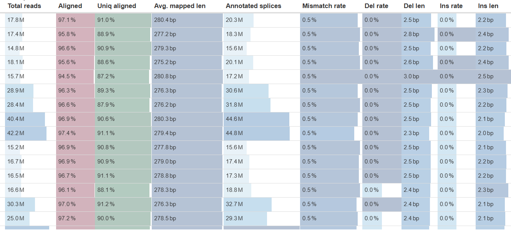

Alignment and unique alignment rates are also plotted as bar plots.

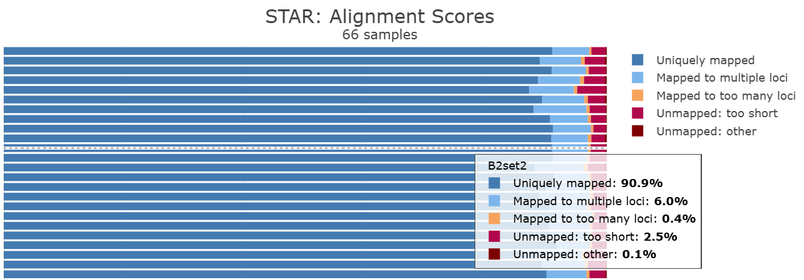

From these results, the QC statistics that we would want to particularly focus on are **Total reads**, **Aligned**, and **Uniq aligned**.

#### 4.1.1 Total reads

Read depth is a key feature of any sequencing data that limits analysis results. Higher read depth will allow DGE analysis to detect more differentially expressed genes, especially those with low expression.  

**Interpretation**
- *Expectations for good quality data* There are varying standards for the minimal number of aligned reads, but in general, each sample should have at least 10 - 15 million reads. According to [ENCODE Bulk RNAseq criteria](https://www.encodeproject.org/data-standards/rna-seq/long-rnas/), each sample needs to have above 30 million aligned reads, which is more difficult to achieve. 
- *Shall I have as many reads as possible? Not really.* As stated in this [workshop](https://hbctraining.github.io/DGE_workshop_salmon/lessons/01_DGE_setup_and_overview.html), increasing read depth is less cost-effective in identifying DEGs than adding more replicates.

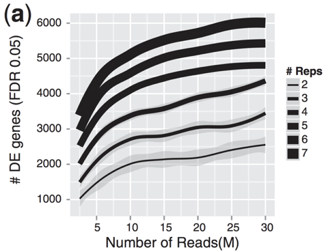
*Increasing the replicates is preferred over deepening the number of reads. As long as read depth is acceptable, it is better to increase reps to detect more DE genes.*

#### 4.1.2 Aligned and Uniq aligned rates
When performing alignment on a well-annotated genome, high quality, properly trimmed reads should have high alignment and unique alignment rates. Low alignment rates are indicative of problematic library or contamination from other organisms.

**Interpretation**
- *Expectations for good quality data* Both rates shall be high as possible. Good quality reads should have at least **75%** ~ 80% uniquely mapped reads ([Ref](https://hbctraining.github.io/Intro-to-rnaseq-hpc-O2/lessons/04_alignment_quality.html#:~:text=As%20an%20example%2C%20a%20good,actual%20sequence%20sample%20is%20good.)), ideally higher than 90% ([Ref](https://www.lexogen.com/blog/rna-lexicon-data-analysis-and-quality-control-tertiary-analysis/)). 
- *Low quality data* The quality of library need to be assessed when unique alignment rate is lower than 70%.

### 4.2 QC using `qualimap` / `RSeQC` | strandness, read distribution, gene coverage, GC bias

Both `qualimap` and `RSeQC` are command-line tools that can generate detailed QC reports on `bam` reads. Since there are some overlaps in functionality between the two tools, here we discuss and compare reports from both of them, mainly for four metrics: **strandness**, **read distribution**, **5'-3' bias**, and **GC bias**.

---

#### 4.2.1 Running `qualimap` and `RSeQC`

*Making reports for `qualimap`*

Running `qualimap` (see [manual](http://qualimap.conesalab.org/doc_html/command_line.html#rna-seq-qc) and [expected output](http://qualimap.conesalab.org/doc_html/analysis.html#rnaseqqc)) in `RNAseq` mode requires aligned `bam` files and `gtf` annotation file. For example:

```bash
# For PE experiment
qualimap rnaseq \
-outdir ${OUTDIR}/${testID} \
-bam ${bampath} \
-gtf  ${GTFpath} \
--paired \
--sequencing-protocol strand-specific-reverse \
--java-mem-size=30G
```

This will generate reports for PE reverse-stranded RNAseq experiment. Additionally, there is a `multi-bamqc` mode, which is useful for finding relationships between multiple `bam` files.

*Making reports for `RSeQC`*

Slightly different from `qualimap`, `RSeQC` ([website](https://rseqc.sourceforge.net/)) does not have a single command that automatically generate all QC metrics. Each metric has its own function.

Before generating reports ...
1. You may want to convert `gtf` to `bed12`, which is the only annotation format recognisable by `RSeQC`, as follows. Note, `bedops gtf2bed` does not work for `bed12` files.

```bash
# GTF to BED12 conversion using UCSC tools
myGTF="${NAME}.gtf"

gtfToGenePred ${myGTF} ${NAME}.genePred
genePredToBed ${NAME}.genePred ${NAME}.bed12

# Sort using genomic coordiates
sort -k1,1 -k2,2n ${NAME}.bed12 > ${NAME}.coord_sorted.bed12 
```

2. `RSeQC` is particularly slow on running `geneBody_coverage.py` command. In this situation, it is recommended to downsample `bam` reads before generating reports, which does not impact QC results (As previously implemented in nf-core [pipeline](https://github.com/nf-core/rnaseq/issues/36)). [Method](https://bioinformatics.stackexchange.com/questions/402/how-can-i-downsample-a-bam-file-while-keeping-both-reads-in-pairs) for downsampling is taken from discussion.

```bash
# Downsample bam to selected size
# Samtools only works with fraction

inBAM="${testID}_Aligned.sortedByCoord.out.bam"
downBAM="${testID}_1Mdownsample.bam"

READS="1000000" # Output depth
fraction=$(samtools idxstats "$inBAM" | cut -f3 | awk -v ct=$READS 'BEGIN {total=0} {total += $1} END {print ct/total}') # Divided by original depth
samtools view -b -s "$fraction" "$inBAM" > "$downBAM"
```

After preparing input files, generate reports for metrics.

```bash
# Required: prepare BED12 annotation
# Optional: downsample BAM for geneBody_coverage

infer_experiment.py -r ${BED12} -i ${BAMFILE} > ${OUTDIR}/${testID}.infer_experiment.txt
geneBody_coverage.py -r ${BED12} -i ${BAM1M} -o ${OUTDIR}/${testID}
read_distribution.py -r ${BED12} -i ${BAMFILE} > ${OUTDIR}/${testID}.read_distribution.txt
read_GC.py -i ${BAMFILE} -o ${OUTDIR}/${testID}

# Tin scores (very time consuming, not working for me)
# tin.py -i ${BAMFILE} -r ${BED12} > ${OUTDIR}/${testID}.summary.txt
```

---

Now moving to the reports! I will make it clear on where you can use to find these figures.

#### 4.2.2 Strandness [`RSeQC`:`infer_experiment.py`]

Strandness is a *highly crucial feature* of an RNA-seq library and impacts how a feature counter shall be assigned aligned reads to genes or transcripts. Providing incorrect strandness will lead to inaccurate expression quantification that negatively impact analysis reliability.

There are three possible strandness: **unstranded** (default for most analysis softwares), **forward**, and **reverse**. 

It is recommended to check your library's strandness using tools like `RSeQC`, for several reasons:
- Firstly, you may not always know the kit used for your data.
- Additionally, in cases where you know the strandness information, the consistency between actual and software-predicted strandness is an important metric indicating that library preparation is successful. For example, you would expect the majority of reads coming from and being mapped to the same strand if the library is *forward*.

In raw `infer_experiment.py` report, `RSeQC` is comparing the strand of read and the gene it maps to. Reads with opposite signs (`+-`, `-+`) come from antisense strand, and reads with same signs (`++`, `--`) come from sense strand.
- For pair-end, *forward* is `1++,1--,2+-,2-+`. *Reverse* is `1+-,1-+,2++,2-- `
- For single-end, *forward* is `++, --`. *Reverse* is `+-, -+`

These symbols are then translated to "sense" or "antisense" labels (with respected to R1) in `multiqc` aggregated report.

**Interpretation**
- *Expectations for good quality data* Ideally, for unstranded experiment, proportion of sense and antisense reads should be the same (i.e. between 40-60 for each). For stranded experiment, proportion of reads from same strand should be higher than **80-90%**. 
- *Low quality sample* The sample has low quality when the kit strandness is inconsistent with predicted strandness. For example, antisense read proportion below 60% for an antisense experiment likely indicate **contamination** and should be carefully inspected.

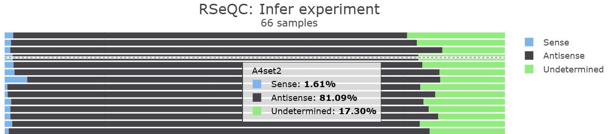
*Example of a stranded experiment - Can you tell its strandness?*

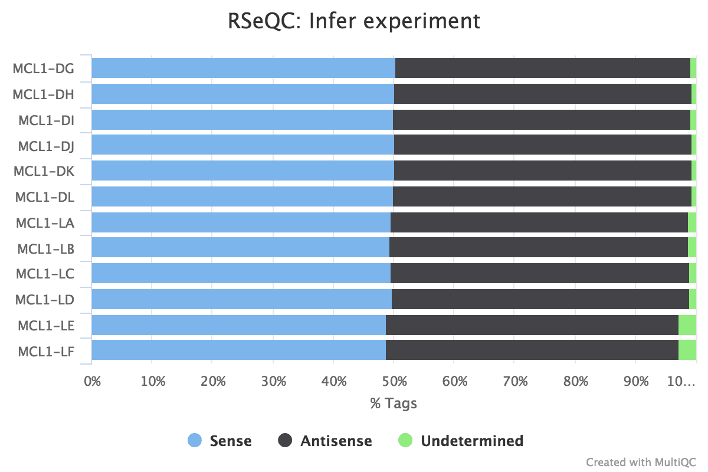
*How can you tell that the data is unstranded?* ([Ref](https://training.galaxyproject.org/training-material/topics/transcriptomics/tutorials/rna-seq-reads-to-counts/tutorial.html))

> **More on stranded libraries: what are them, and why is it important to know them?**
>
> *What are stranded libraries?*
>
> In many cases, the RNA-sequencing library will be **stranded** (also known as directional or strand-specific). For single-end sequencing, all reads will be exclusively derived from sense **or** antisense strands. In paired-end sequencing, there will be a **fixed relationship** between strandness and read pair, for example R1 always representing the sense strand. Such specificity ensures that reads can be accurately assigned to features, particularly when assigning reads to overlapping genes.
> 
> As a quick recap, sense strand (coding strand) contains the same sequence as mRNA except that T becomes U. Antisense strand (non-coding, template strand) is read by RNA polymerase to generate mRNA and is the reverse-complement of mRNA.
>
> *Generating stranded libraries using the dUTP method*
> 
> One common method used to generate stranded libraries is the dUTP method, where **R1 keeps information from the antisense strand**. In this method, strand selection is performed during cDNA synthesis. The first strand cDNA (antisense) is synthesised using mRNA as template. Then, the second strand is synthesised using **dUTP** instead of dTTP. This double strand structure enables efficient ligation to Y-adapters, and fragment at second strand can be subsequently removed using **UDG** [uracil DNA glycosylase] enzyme following ligation. Since the Y-adapters are *asymmetric* (i.e. the adapter sequence being ligated at 5' and 3' ends are different), the strandness information is preserved throughout subsequent PCR amplification and sequencing.
>
> The method is visualised in this nice [video](https://www.youtube.com/watch?v=OoBITqzcy1Y) and the figure below. 
> 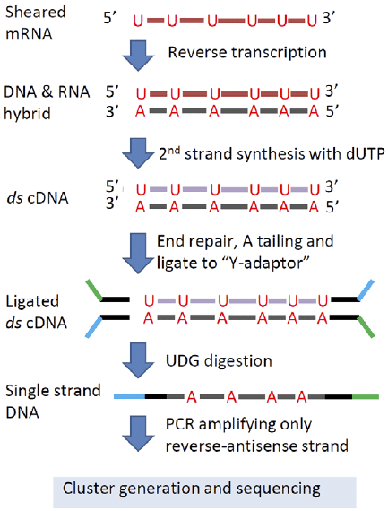
>
> *Providing strandness for feature counters*
>
> Many feature counters will require such information as input to more correctly assign reads to features. It is critical to provide the correct information. Here is a summary of parameters for common aligner / counters ([Ref](https://chipster.csc.fi/manual/library-type-summary.html)). **Always change strandness to make it consistent with your data!**
> |Tool            |unstranded|R1 == sense|R1 == antisense|
> |----------------|----------|----------|--------------|
> |TopHat/Cufflinks|`library-type fr-unstranded`|`library-type fr-secondstrand`|`library-type fr-firststrand`|
> |HISAT2|*default*|`--rna-strandedness F (SE), FR (PE)`|`--rna-strandedness R (SE), RF (PE)`|
> |HTSeq|`stranded --no`|`stranded --yes`|`stranded --reverse`|
> |featureCounts|`-s 0`; *default*|`-s 1`| `-s 2`|
> |RSEM|`--strandness none`; *default*|`--strandness forward`|`--strandness reverse`|
> |Salmon|`-l IU`|`-l ISF`|`-l ISR`|

---

#### 4.2.3 Read distribution [`qualimap`:*Genomic origin of reads*, `RSeQC`:`read_distribution.py`]

The Read distribution section displays the percentage of genomic feature assigned for aligned reads. 

**Interpretation**
- *Expectations for good quality data* For DGE analysis (enriched in mRNA), you shall expect the majority of reads (above **70%**) corresponding to exon-associated features (for `RSeQC`, this would be the sum of CDX_Exons and Exons at 5' and 3' UTR).
- *Shall I always expect low percentage of intronic reads?* Similar to strandness, reads will have different distribution patterns if a different library preparation method is used. For example, in *total RNA-seq* there will be more intronic RNAs.

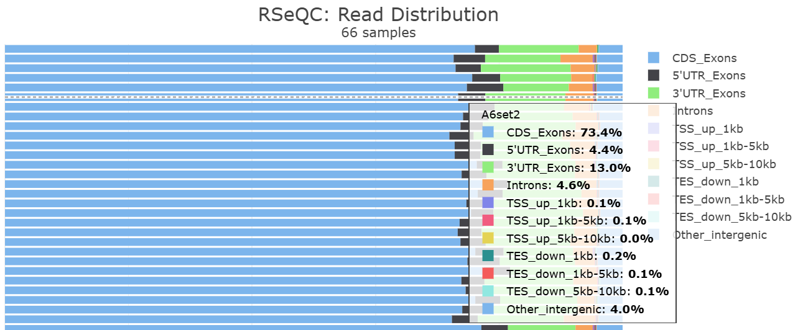
*While both tools are able to produce this section, `RSeQC` uses a more detailed feature category than `qualimap`.*

---

#### 4.2.4 Gene coverage [`qualimap`:*Gene coverage profile*, `RSeQC`:`geneBody_coverage.py`]

Gene coverage profiles show the integrity of RNA during seqeuncing.

**Interpretation**
- *Expectations for good quality data* The gene coverage is expected to be **consistent** throughout the gene body, and there shall be **no noticeable bias at 5' or 3' ends**. It is common to have dips at start (5') and end (3') on the X axis. Bias towards 3' end may suggest[ degradation of RNA](https://journals.plos.org/plosone/article?id=10.1371/journal.pone.0091851) at 5' ends, which is indicative of low quality. 
- *Exceptions to this rule* For data coming from 3' assay (such as [QuantSeq](https://www.lexogen.com/quantseq-family/)), peaks at 3' tail are actually expected and indicates that the kit works as expected. These kits are used when you are interested in 3' UTRs.

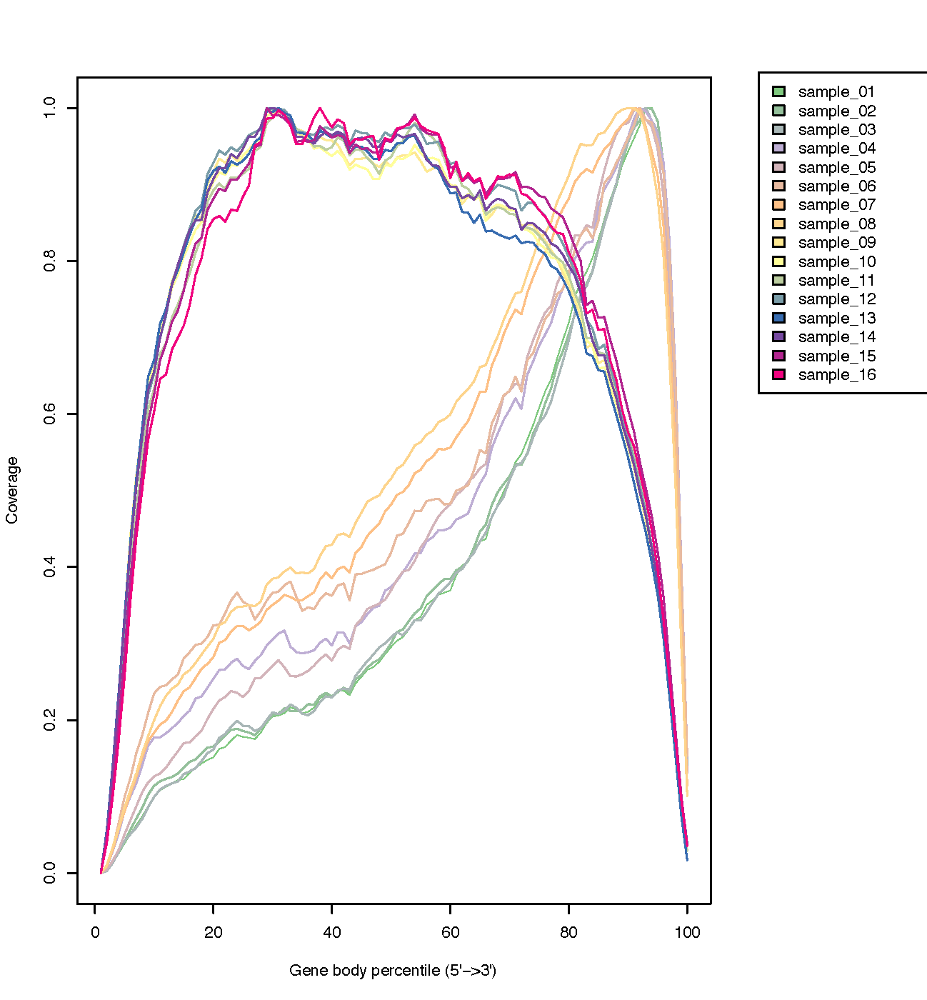
*This figure was taken from `RSeQC` website, and compares samples with uniform gene coverage and those with 3' bias.*

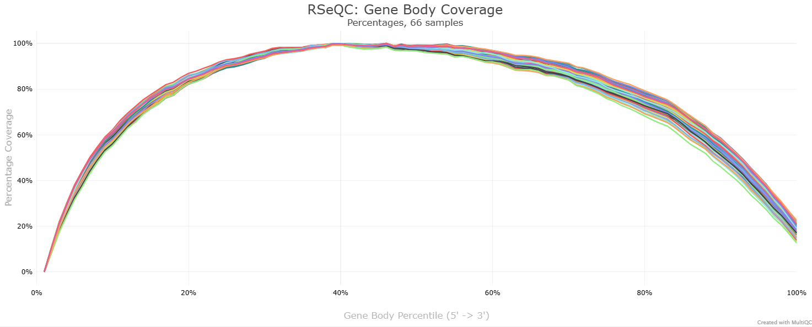
*This is another example from my `RSeQC` results. Note that `gene_coverage.py` is known to be very slow and memory-intensive, so you may want to downsample your data (see before), or restrict the annotation to contain only house keeping genes before running this command.*

---

#### 4.2.5 GC bias [`RSeQC`:`read_GC.py`]

PCR is often the main source of GC bias. Since PCR amplification is an exponential process, the resulting difference may be very significant. There is a discussion in this [blog](https://mikelove.wordpress.com/2016/09/26/rna-seq-fragment-sequence-bias/).

GC bias may arise from two sources:
- *Biological, fragment-level*: This relates to the GC% of the fragment being sequenced and of the underlying gene. cDNA derived from regions with extremely low or high GC% (<35% or >65%) will be less preferentially sequenced. 
- *Technical, sample-level*: Technical bias are sample-specific and impact the expression of all genes in the library. For example, differences in temperature in PCR thermal cyclers may cause data prepared in different batches to have different GC bias.

Since GC content is an inherent feature of gene, and DGE analysis compares the same gene across sample, we would expect bias from this source to have minimal effect on analysis. Therefore, we are mainly concerned with sample-level GC bias. GC bias can be studied in `fastqc` for raw reads, or for aliged reads using `read_GC.py`.

**Interpretation**
- *Expectations for good quality data* In general, all sample shall have bell-shape GC curve (same as `fastqc` interpretation). Furthermore, the trend should be consistent across samples, where no sample having shift in GC content.
- *Correcting sample-level GC bias* Sample-level GC bias is common when data for analysis come from different *batches*, and does not mean that data have *bad quality*. 
  - Packages such as `EDASeq` or `cqn` estimate correction factors for sample-specific effects that can be used for DGE analysis tools like `edgeR`. 
- *When will fragment-level effect matter?* 
  - While being less relevant in DGE's context, fragment-specific GC effect matters when comparing expression between genes in the same sample, or when comparing expression between isoforms of the same gene. 
  - In these situations, tools like `Salmon` applies GC normalisation for more accurate counting. `alpine` can also perform GC bias correction at the fragment level.
  - Gene length normalisation is conceptually similar to GC bias. They impact interpretation of transcripts from different isoforms / genes, since longer transcripts will produce more fragments than shorter ones.

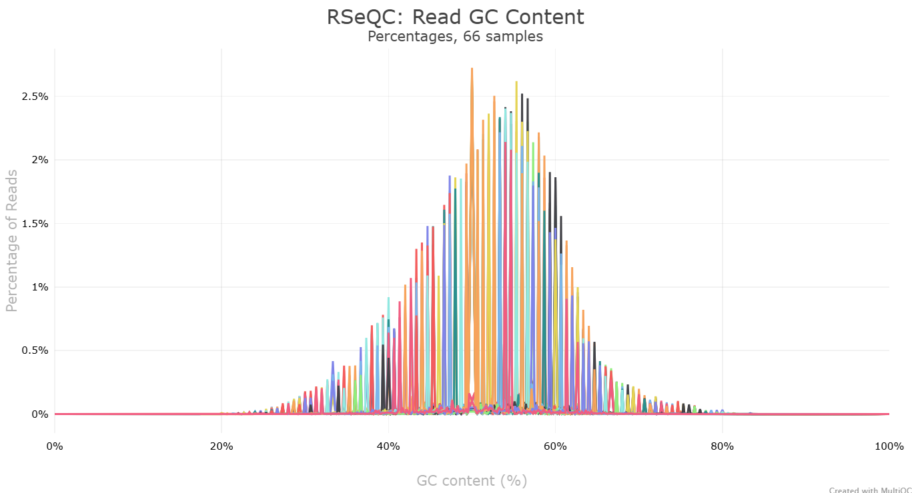
*An example of GC content from my data.*

### 4.3 Other QC tools: `Picard`, `Preseq`, `dupRadar`

Apart from the discussed reports, there are other tools that can be used when performing quality checking. Many training websites nicely summarise these QC tools and how to interpret the results ([Zymo Research](https://github.com/Zymo-Research/service-pipeline-documentation/blob/master/docs/how_to_use_RNAseq_report.md), [Galaxy](https://training.galaxyproject.org/training-material/topics/transcriptomics/tutorials/rna-seq-reads-to-counts/tutorial.html), [hbctraining](https://hbctraining.github.io/Intro-to-rnaseq-hpc-salmon/lessons/03_QC_STAR_and_Qualimap_run.html), [lexogen](https://www.lexogen.com/blog/category/rna-expertise-hub/)), which I have frequently referenced when phrasing my discussion. 

For example:
- `Picard MarkDuplicates` studes the percentage of duplicated reads in each sample. For DGE analysis, it is **not recommended to remove duplicates**.
- `Preseq` studies the library complexity, i.e. how many unique reads / additional information can be generated when increasing read depth. However, note that it is preferred to add more replicates than increase read depth to detect more DEGs.
- `dupRadar` also studies duplication rate, but against gene expression level. In a good quality library, highly expressed genes are expected to have higher duplication rate than lowly expressed genes.

Additionally, depending on your goal, `RSeQC` can generate other metrics, such as `junction_saturation.py` to see if read depth is sufficient for alternative splicing analysis.

Overall, the key of quality checking is to always perform and interpret QC results with respect to your library kit and experiment aim. **There is no absolute universal thresholds of QC metrics, and you should always adjust your expectation depending on your exact situation.**


*That's it!*
